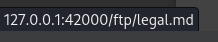

# Owasp_juice_shop_practic

# Введение

OWASP Juice Shop (Магазин сока) - вероятно, самое современное и сложное
небезопасное веб-приложение! Его можно использовать на тренингах по
безопасности, демонстрационных материалах, CTF и в качестве подопытного
кролика для инструментов безопасности!

Включает в себ узвимости как из всей перой десятки OWASP, так и многие
другие, которые можно встретить в реальных приложениях. Приложение
содержит огромное количество хакерских заданий различной сложности, в
которых пользователь должен использовать лежащие в его основе
уязвимости.

# Установка

Проведем установку магазина сока на kali linux. Проведем обновление
системы:

sudo apt-get update

sudo apt-get upgrade

## 1 Вариант

Для работы магазина требуется установить Node.js

sudo apt install nodejs

sudo apt install npm

Теперь требуется клонировать репозиторий магазина сока на локальный
компьютер.

[Juice Shop](https://github.com/bkimminich/juice-shop.git)

git clone <https://github.com/bkimminich/juice-shop.git>

Перейдем в клонированный каталог и установим зависимости

cd juice-shop  
  
npm install

После установки зависимости запустим веб-сервер и зайдем на него по
ссылке: http://localhost:3000

## 2 Вариант

Скачивание как рекомендует официальный сайт
[kali](https://www.kali.org/tools/juice-shop/):

sudo apt install juice-shop

Запускаем работу сервера

После открытия ссылки

Для остановки работы сервера требуется ввести команду:

juice-shop-stop -h

# Задания

## Задание score board (\*)

Откроем код страницы на F12 и посмотрим куда мы можем попасть

Находим ссылку на ютуб видео, искали медь…нашли
золото…<https://www.youtube.com/watch?v=9PnbKL3wuH4>

Ищем дальше. Находим ссылку на главную страницу с заданиями

Находим таблицу с заданиями по уровням

## Задание Login Admin (\*\*)

Вернемся на сайт и откроем комментарии. Под первой же вкладкой находим
имя аккаунта админа.

Вводим аккаунт и используем обход аутентификации при помощи sql инъекции

admin@juice-sh.op’ or ‘2’=’2

Пароль вводим любой

## Задание View Basket (\*\*)

Задание выполнилось случайно после того как оставил товар в корзине и
зашел в неё

## Задание Bonus Payload (\*)

Добавляем в поисковую строку полезную нагрузку

\<iframe width=“100%” height=“166” scrolling=“no” frameborder=“no”
allow=“autoplay”
src=“https://w.soundcloud.com/player/?url=https%3A//api.soundcloud.com/tracks/771984076&color=%23ff5500&auto_play=true&hide_related=false&show_comments=true&show_user=true&show_reposts=false&show_teaser=true”\>\</iframe\>

Получаем музыку, которую не слышно

Причем запускаем из score board, иначе задание не засчитывается.

## Задание Bully Chatbot(\*)

Создаем тестовый аккаунт

Входим во вкладку с обратной связью, открывается чат с ботом. Следует
заспамить его фразой о купоне, после упорной атаки он сдается.

## Задание Pricacy Policy (\*)

После создания аккаунта входим во вкладку Pricacy Policy

## Задание DOM XSS (\*)

Вводим в поисковую строку \<iframe src=“javascript:alert(\`xss\`)”\>

## Задание confidential document (\*)

Переходим во вкладку About us

Нажимаем ссылку, понимаем, что путь идет через ftp

Переходим по ссылке и открываем конфиденциальные файлы

## Задание Error Handling (\*)

Ошибку вызвал, даже не заметно как.

## Задание Exposed Metrics (\*)

По названию задания становится понять, что необходимо перейти по адресу
/metrics/

## Задание Admin Section (\*\*)

Заходим под админским аккаунтом, по аналогии с предыдущим заданием
переходим по адресу /administration/

## Задание Five-Star Feedback (\*\*)

В меню из предыдущего задания удаляем 5-звездочный комментарий

## Задание Zero Stars (\*)

Выдаем сокрушительный отзыв с одной звездой. Переходим в обратную связь,
проходим капчу и входим в код элемента. Убираем часть, которая отвечает
за отключение кнопки.

## Задание Mass Dispel (\*)

Отказывается выполняться

## Задание Web3 Sandbox (\*)

По названию задания становится понять, что необходимо перейти по адресу
/web3-sandbox/

## Задание Missing Encoding (\*)

Заходим на вкладку со стеной фотографий. Находим первую, которая
некорректно отображается. Изменяем код элемента с \# на %23

## Задание Outdated Allowlist (\*)

Открываем в score-board код элемента, ищем redirect и переходим по
данному адресу

## Задание Repetitive Registration (\*)

При регистрации заполняем все данные, повторяем пороль, после чего
изменяем изначальный.

Выполнены все задания на 1\* и некоторые на 2\*\*
